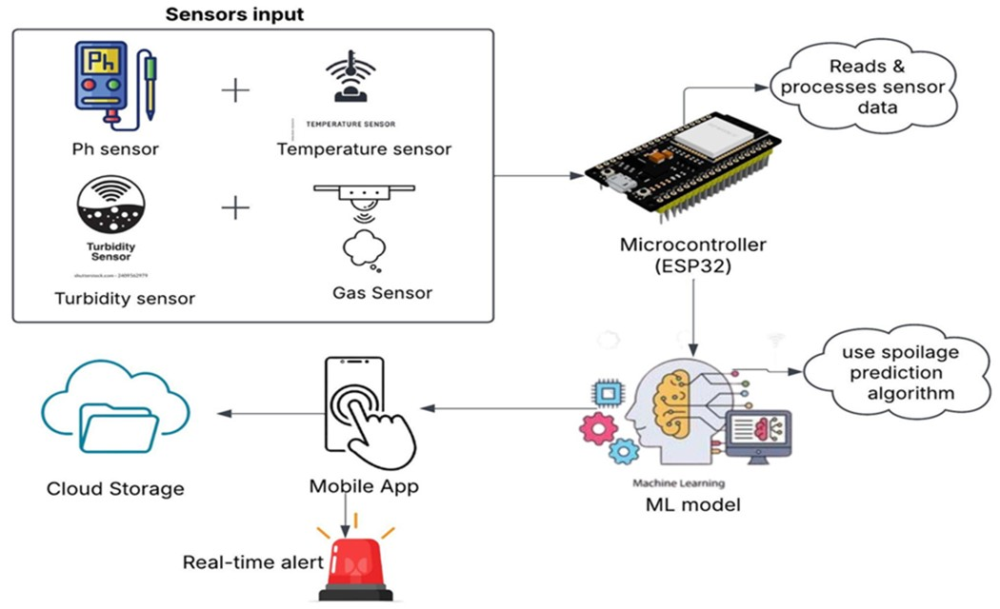
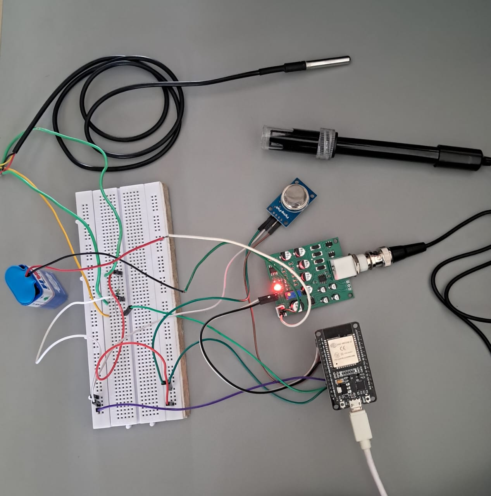
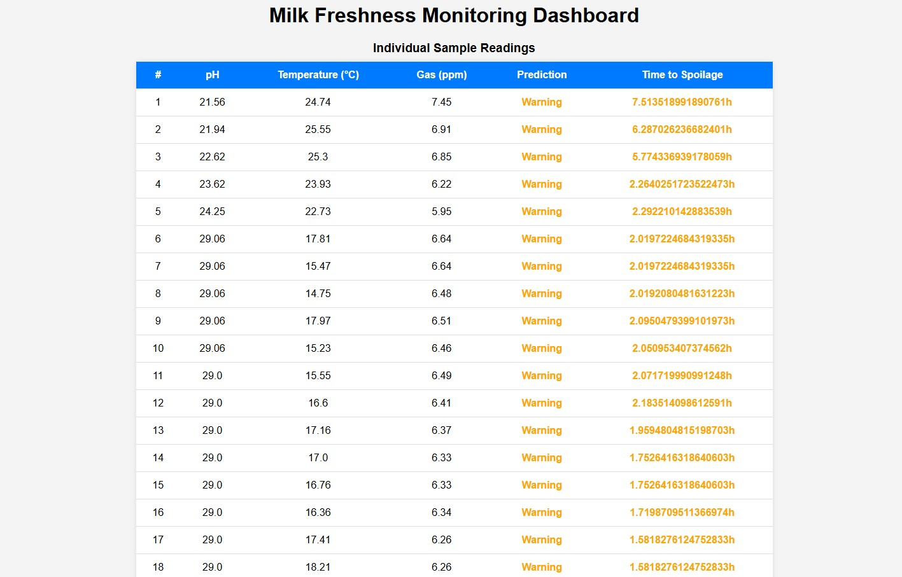
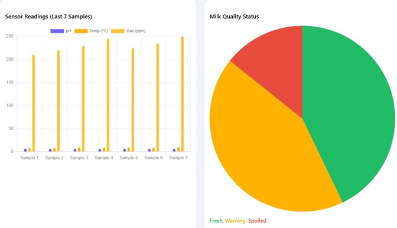
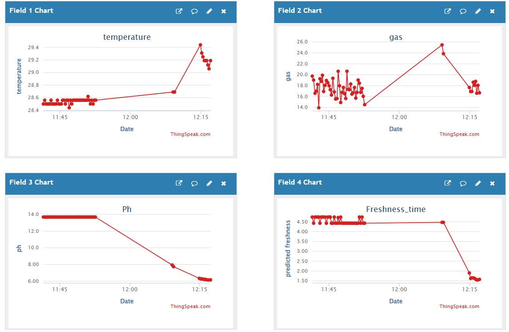

# 🥛 MilkSafe - An IoT-Powered Milk Freshness Analyzer Using Sensors and Machine Learning

This repository presents the design and implementation of an IoT-powered Milk Spoilage Analyzer using smart sensors and a machine learning model. It enables real-time monitoring, predictive analytics, and early warnings to ensure milk safety, reduce wastage, and optimize the dairy supply chain.

---

## 📑 Contents

- [🧾 Introduction](https://github.com/mohanrajs2006git/MilkSafe/#-introduction)
- [🧭 Overview](https://github.com/mohanrajs2006git/MilkSafe/#-overview)
- [🎯 Goals and Objectives](https://github.com/mohanrajs2006git/MilkSafe/#-goals-and-objectives)
- [🎯 Target Audience](https://github.com/mohanrajs2006git/MilkSafe/#-target-audience)
- [🚀 Key Features](https://github.com/mohanrajs2006git/MilkSafe/#-key-features)
- [🛠️ Technical Approach](https://github.com/mohanrajs2006git/MilkSafe/#-technical-approach)
- [📡 Sensor Details](https://github.com/mohanrajs2006git/MilkSafe/#-sensor-details)
- [🧪 Sensor Threshold Reference Table](https://github.com/mohanrajs2006git/MilkSafe/#-sensor-threshold-reference-table)
- [📦 Required Components and Bill of Materials](https://github.com/mohanrajs2006git/MilkSafe/#-required-components-and-bill-of-materials)
- [📊 Block Diagram](https://github.com/mohanrajs2006git/MilkSafe/#-block-diagram)
- [🔌 Pin Connections](https://github.com/mohanrajs2006git/MilkSafe/#-pin-connections)
- [🖼️ Project Images](https://github.com/mohanrajs2006git/MilkSafe/#-project-images)
- [📽️ Application Videos](https://github.com/mohanrajs2006git/MilkSafe/#application-videos)
- [👥 Contributors](https://github.com/mohanrajs2006git/MilkSafe/#contributors)
- [🎓 Acknowledgements](https://github.com/mohanrajs2006git/MilkSafe/#acknowledgements)
- [📬 Contact Information](https://github.com/mohanrajs2006git/MilkSafe/#contact-information)

---

## 🧾 Introduction

Milk is one of the most consumed dairy products worldwide, yet it is highly perishable. Daily, millions of liters of milk are wasted due to spoilage caused by improper storage, transportation delays, and lack of effective monitoring. Most rural milk collection centers only measure fat and SNF content, ignoring microbial quality.

To address this challenge, **MilkSafe** integrates sensors (pH, gas, temperature, and turbidity) with an ESP32 microcontroller to provide real-time freshness tracking and predictive analysis. Alerts are generated when milk quality degrades, helping farmers and dairy centers prevent spoilage and economic loss. Data is transmitted wirelessly for remote dashboard access.

---

## 🧭 Overview

- **Microcontroller**: ESP32  
- **Sensors Used**:
  - E201-BNC pH Sensor  
  - MQ-135 Gas Sensor  
  - DS18B20 Temperature Sensor  

Sensor data is processed by a trained machine learning model that estimates the remaining freshness time. The results are displayed on a web-based dashboard.

---

## 🎯 Goals and Objectives

1. Monitor milk freshness through key parameters (pH, gas, temperature, turbidity).  
2. Predict spoilage time using a trained machine learning model.  
3. Enable wireless real-time monitoring and early alerts.  
4. Prevent health hazards and reduce milk wastage.  
5. Provide a low-cost, user-friendly solution for rural and commercial dairy chains.

---

## 🎯 Target Audience

- Dairy farmers  
- Milk collection centers  
- Dairy processors  
- Rural cooperatives  
- Food safety researchers  

---

## 🚀 Key Features

- Real-time sensor monitoring using ESP32  
- Wireless data transmission via Wi-Fi  
- ML-based spoilage time prediction  
- Freshness classification: Fresh / Warning / Spoiled  
- Cloud dashboard visualization  
- Scalable, portable, cost-effective

---

## 🛠️ Technical Approach

- **Hardware**: ESP32, MQ-135, DS18B20, E201-BNC  
- **Software**: Arduino IDE (firmware), Python (ML & dashboard)  
- **ML Model**: Random Forest Regressor  
- **Interface**: Web dashboard using Matplotlib and Pandas  

---
## 📡 Sensor Details

- **pH Sensor**: Indicates milk acidity (spoilage)  
- **Gas Sensor**: Detects gases like ammonia/H₂S from microbial activity  
- **Temperature Sensor**: Monitors cold chain conditions  
---
## 🧪 Sensor Threshold Reference Table

| Parameter         | Fresh Milk Value                  | Spoiled Milk Value                           |
|------------------|------------------------------------|----------------------------------------------|
| **Temperature**   | 0–4°C (ideal storage)             | >8°C increases spoilage risk                 |
| **pH Level**      | 6.5 – 6.8                         | <6.0 (acidic = spoiled)                      |
| **Gas Sensor (MQ3)** | 200 – 300 ppm (fresh)            | >350–400 ppm indicates spoilage gases        |

---
## 📦 Required Components and Bill of Materials

| Component           | Quantity | Cost (INR) |
|---------------------|----------|------------|
| ESP32               | 1        | ₹350       |
| E201-BNC pH Sensor  | 1        | ₹1700      |
| MQ-135 Gas Sensor   | 1        | ₹200       |
| DS18B20 Temp Sensor | 1        | ₹100       |
| Jumper Wires        | 1 set    | ₹50        |
| Breadboard          | 1        | ₹80        |
| Battery / USB       | 1        | ₹30        |
| **Total**           | —        | **₹2,510** |

---

## 📊 Block Diagram

---

## 🔌 Pin Connections

| Sensor     | ESP32 Pin   |
|------------|-------------|
| MQ-135     | GPIO36 (A0) |
| DS18B20    | GPIO15      |
| E201-BNC   | GPIO39 (A3) |

---

## 🖼️ Project Images
## Working Model

### 📊 Prediction Table  

### 📈 Bar & Pie Chart - Freshness Distribution  

### 🌐 ThinkSpeak Cloud Monitoring  

---

## Application Videos
https://github.com/user-attachments/assets/ed3032ad-ff12-4b73-a92d-7d604d7b6702

📢 This video showcases the real-time functioning of the MilkSafe system.

➤ Sensors collect pH, gas, and temperature data from milk.

➤ ESP32 transmits this data wirelessly.

➤ Machine learning model predicts spoilage time and freshness category.

➤ Dashboard displays trends and sends alerts for timely action.

## Contributors

- Mohan Raj S  
- Likhit S  
- Manishankar M  
- Naveensurya V  

---

## Acknowledgements

- Dr. S. Ramkumar, Associate Professor, ECE, Sri Eshwar College of Engineering  

---

## Contact Information

- Mohan Raj S – [mohanrajs.ec2023@gmail.com](mailto:mohanrajs.ec2023@gmail.com)  
- Institution: Sri Eshwar College of Engineering  
- Duration: Jan – May 2025
